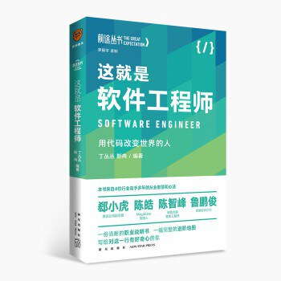

# 《这就是软件工程师》 读书笔记

之前看过 [极客时间：左耳听风(陈d皓)](https://time.geekbang.org/column/intro/48) 一专栏， 他是陈皓在极客时间写的付费专栏。陈皓从2002年开始写技术博客，2009年左右开始在独立域名 [**酷壳**](https://coolshell.cn/) 上分享技术观点和实践总结，是个颇有影响力的技术博客。此书算是中文世界的 [《程序员修炼之道：通向务实的最高境界》](https://book.douban.com/subject/35006892/)，文中对个人成长、职业发展的讨论颇有价值，值得入行不久的程序员好好读一下。看到本书的作者有陈皓，便毫不犹豫购入一读。该书某种程度上与《左耳听风》专栏有些内容趋同，但读完亦有不少启发。

##### 阅读代码

对于软件工程师工程师来说，阅读代码的能力可能要比写代码的能力要重要一些。只有阅读过大量的代码，才能知道好的代码应该怎样去写。通常学术训练的第一步便是要读大量论文，工程师亦要借鉴这种方式，读大量项目的代码（设计文档）来熟悉精通某一领域。工程师应该借鉴研究人员读文献的方式，读大量的代码。才能在技术上不断提升突破，保持在技术的前沿。

##### 入门语言

自己已经对 JavaScript 比较熟悉， 需要再学习一门服务端语言，才能算的上职业的软件工程师。计划2021年系统学习 Java Spring SpringBoot Java 体系下的后端技术。作为一名 Web 开发工程师，最基本的能力要求是前后端的业务开发都可以做，现在自己还没有达到这个程度，需要好好努力。

##### 精进学习

软件工程师这一职业，对于持续学习能力要求比较高。加上自己学习编程时间较晚，更应该好好努力。自己目前总结需要持续精进提高的方向可以分为理论知识和工程能力这两个方面。

**理论知识**主要有

- 语言与框架 (JavaSript TypeScript Java VUE Spring 等)
- 系统与协议 (浏览器 JVM Http 等)
- 基础理论 (计算机体系、编译原理、算法 等) 

**工程能力**主要是

- 领域工程经验(前端 后端)
- 编程技术水平(重构 设计模式 编程范式)

##### 持续分享

以输出为目的的学习是最有效率的，当你想熟悉某一领域，最好的方式是写一本书。代码是设计的实现，好的文档比代码更容易学习某种架构的设计思路，有些工程师对“文档工程师”和“ Markdown 开源项目”态度颇为戏谑，殊不知文档能力与代码能力并无高下之分，对于软件工程师来说，最根本的还是其设计能力，代码和文档都是设计的一种呈现。"Talk is cheap, Show me the code" 此言流毒甚远。自己计划以GitHub 为平台， 保持输出的习惯。把自己读代码、设计代码的过程、体会和经验予以记录，通过输出来提高自己输入的效率。

自己现在的水平和习性还谈不上一名职业化的软件工程师，好好努力吧，成为一名职业的软件工程师，成为这个行业的中流砥柱。

2021年1月28日